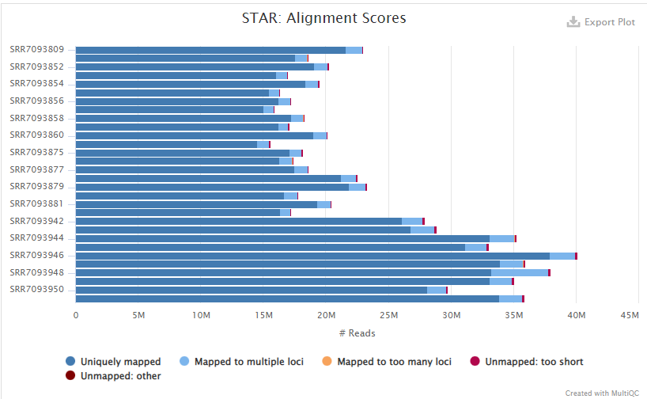
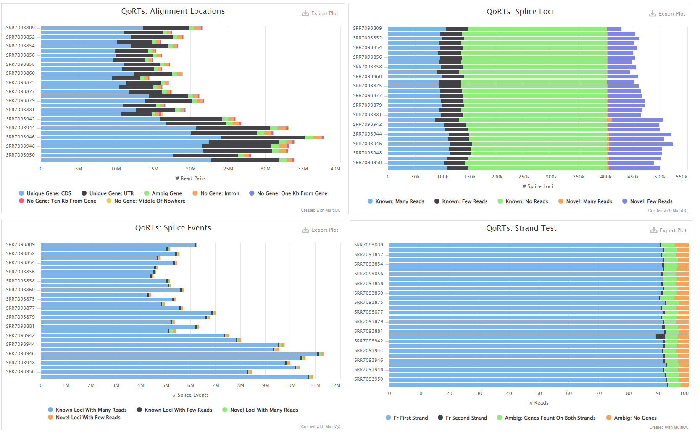

# 1 Introduction

Hutchinson-Gilford progeria syndrome (HGPS) is a rare and fatal disease that is characterized for it's accelerated aging; it is well known that the cause of HGPS is abnormally formed lamin A (progerin), either from a point mutation in the *LMNA* gene (G608G) or through abnormal post-translational processing (ZMPSTE24 gene mutation)[1](https://pubmed.ncbi.nlm.nih.gov/16838330/), yet it was not till recently that the more research has been done in revealing the molecular mechanisms behind the disease phenotype. A study done in 2018[2](https://www.ncbi.nlm.nih.gov/pmc/articles/PMC6209416/) found that PRPS1 protein and transcript levels are significantly decreased in HGPS cell lines vs healthy parental control. This gene is known to be necessary for purine metabolism and nucleotide biosynthesis. However, this study was done on a limited number of samples (2 HGPS and 2 non-disease control) and the phenotypic age of samples are not known as they were derived from cell lines.

Another study in late 2018 generated a large dataset of RNA-seq data of fibroblast cell lines from patients of a wide-range of ages as well as 10 HGPS patients[3](https://genomebiology.biomedcentral.com/articles/10.1186/s13059-018-1599-6) for the purpose of creating a machine learning method that could predict age. The algorithm correctly could identify accelerated aging in humans showing that there are significant transcriptomes of skin fibroblasts that retain important age-related (and accelerated aging) signatures.

In this project, I wanted to use the extensive patient dataset to corroborate the findings that PRPS1 is indeed under-expressed in HGPS patients compared to both young and old patients while also exploring other potential differential expressed genes that cause the aging phenotype in HGPS patients. Particularly, I believe that HGPS must have significant DGEs from young samples. These genes might potentially be worth studying for accelerated-aging effect of HGPS. 

**Hypothesis:** HGPS has a significant number of different DGEs in comparison to young samples that are not found in old samples.  

---

1. [Hennekam RC. Hutchinson-Gilford progeria syndrome: review of the phenotype. Am J Med Genet A. 2006 Dec 1;140(23):2603-24. doi: 10.1002/ajmg.a.31346. PMID: 16838330.](https://pubmed.ncbi.nlm.nih.gov/16838330/)

2. [Mateos J, Fafián-Labora J, Morente-López M, Lesende-Rodriguez I, Monserrat L, Ódena MA, Oliveira E, de Toro J, Arufe MC. Next-Generation Sequencing and Quantitative Proteomics of Hutchinson-Gilford progeria syndrome-derived cells point to a role of nucleotide metabolism in premature aging. PLoS One. 2018 Oct 31;13(10):e0205878. doi: 10.1371/journal.pone.0205878. PMID: 30379953; PMCID: PMC6209416.](https://www.ncbi.nlm.nih.gov/pmc/articles/PMC6209416/)

3. [Fleischer, J.G., Schulte, R., Tsai, H.H. et al. Predicting age from the transcriptome of human dermal fibroblasts. Genome Biol 19, 221 (2018). https://doi.org/10.1186/s13059-018-1599-6](https://genomebiology.biomedcentral.com/articles/10.1186/s13059-018-1599-6)

---

# 2 Results

Unfortunately, we could not replicate the results of the paper and when we observed the Count Plots for `PRPS1` there didn't seem to be a significant difference between the conditions when we would have expected it to be significantly different between the non-disease vs HGPS samples according to the results of the paper. This could be due to the difference in expressions between patient samples vs. cell cultures.

I decided to create a fourth condition that had a stringent filtering of genes that had to be significant for young samples but also non-significant for old samples. Although this was not very statistically sound... it did allow me to recognize genes that had high correlation between `hgps` and `old` while significantly differentiated in `young`, like `caveolin 1`. I further wanted to explore this difference and ran GO Enrichment analysis on these DESeq2 conditions where I found that a lot of the enriched pathways were similar regardless of whether the `young vs hgps` were filtered or not. For example, both had suppressed `golgi vesicle transport` and `action potential` pathways. Whether these pathways were attributed to accelerated aging... I could not confirm with literature and thus it requires more thorough investigation. Meanwhile the `old vs hgps` DESeq2 genes was suppressed for a lot of developmental and differentiation pathways, which is not surprising.

There are 1111 significant DGE in young samples not found in the DGE of old samples. Among these, it is possible to find genes expression levels that are directly related to the accelerated-aging caused by the LMNA mutation. There is still much to be explored in this data! 

# 3 Methods

## 3.1 Dataset

Used RNA-seq data generated by Salk Institute's for Biological Studies that was taken from Human dermal fibroblast cell lines from patients of a wide-range of ages as well as 10 samples from HGPS patients. [[GEO]](https://www.ncbi.nlm.nih.gov/geo/query/acc.cgi?acc=GSE113957) [[SRA]](https://www.ncbi.nlm.nih.gov/Traces/study/?acc=PRJNA454681) The samples were prepared using Illumina TruSeq Stranded mRNA kit using Poly-A selection and the data is Single-end Stranded with read lengths of 51bp and 75bp. Majority of the samples are run on NextSeq 500 but some run on Illumina HiSeq 2500.

---

All data processing and QC scripts can be found in the [GitHub Repo](https://github.com/laurelis/ANGSD-Final/tree/main/Bash%20Scripts). 

---

## 3.2 Pre-processing

From the RNA-seq dataset I selected for three conditions: 

* 10 samples (<10yo), 10 samples (>80yo), 10 samples (HGPS)

```{r, explore-samples, eval=FALSE}
young=`awk -F ',' '$2<10 {print $1}' SraRunTable.txt | head -n 10`
old=`awk -F ',' '$2>80 {print $1}' SraRunTable.txt | head -n 11 | tail -n +2`
hgps=`awk -vFPAT='([^,]*)|("[^"]+")' -vOFS=, '$15 == "HGPS" {print $1}' SraRunTable.txt`
`echo $young $old $hgps` > SRR_accession_IDs.txt
```

```{}
SRR7093809 SRR7093874 SRR7093875 SRR7093876 SRR7093877 SRR7093878 SRR7093879 SRR7093880 SRR7093881 SRR7093882 SRR7093851 SRR7093852 SRR7093853 SRR7093854 SRR7093855 SRR7093856 SRR7093857 SRR7093858 SRR7093859 SRR7093860 SRR7093942 SRR7093943 SRR7093944 SRR7093945 SRR7093946 SRR7093947 SRR7093948 SRR7093949 SRR7093950 SRR7093951
```

Made sure that these samples all have a read length of `75bp` and are run on `NextSeq 500`. 

```{r, sra-samples}

toc <- read.table('Files/SRA-to-Condition.txt',sep='\t')
sra.table <- read.table('Files/SraRunTable.txt',sep='\t', header=TRUE)
row.names(sra.table) <- sra.table$Run
sra.table[toc[,1],]

```

## 3.3 Indexing and Alignment

Although the original paper aligned to `hg19`, I aligned to the Human reference genome [GRCh38.p13](https://ftp.ensembl.org/pub/release-109/fasta/homo_sapiens/dna/) with `STAR` using the [gene annotation file (version 109)](https://ftp.ensembl.org/pub/release-109/gtf/homo_sapiens/) from ENSEMBL. 

When indexing the genome with `STAR` changed the `--sjdbOverhang` parameter to `74bp` to account for our sample read length.

```{r, genome-index, eval=FALSE}
STAR --runMode genomeGenerate --runThreadN 1 \
        --genomeDir /athena/angsd/scratch/yuc4017/genome/index \
        --genomeFastaFiles /athena/angsd/scratch/yuc4017/genome/Homo_sapiens.GRCh38.dna_sm.primary_assembly.fa \
        --sjdbGTFfile /athena/angsd/scratch/yuc4017/genome/Homo_sapiens.GRCh38.109.gtf \
        --sjdbOverhang 74
```
\

All the sample `fastq` files were downloaded from SRA and aligned to the reference genome with `STAR` default parameters and indexed with `samtools`.

```{r, align-reads, eval=FALSE}
STAR --runMode alignReads \
    		--runThreadN 1 \
    		--genomeDir /athena/angsd/scratch/yuc4017/genome/index \
    		--readFilesIn /athena/angsd/scratch/yuc4017/fastq/${ID}.fastq.gz \
    		--readFilesCommand zcat \
     		--outFileNamePrefix /athena/angsd/scratch/yuc4017/alignments/${ID}. \
    		--outSAMtype BAM SortedByCoordinate

samtools index /athena/angsd/scratch/yuc4017/alignments/${ID}.Aligned.sortedByCoord.out.bam
```
\


## 3.4 FastQC Results

`FastQC` was ran before `featureCounts` to determine quality of reads.




## 3.5 FeatureCounts

`FeatureCounts` was ran specifying the reverse strand `-s 2`, otherwise everything was ran on default parameters.

```{r, featurecounts, eval=FALSE}
featureCounts -s 2 --minOverlap 1 -a /athena/angsd/scratch/yuc4017/genome/Homo_sapiens.GRCh38.109.gtf -o featureCounts.txt /athena/angsd/scratch/yuc4017/alignments/*.bam

```

Download the hg38 Housekeeping Genes `BED` file from [RseQC's SourceForge](https://sourceforge.net/projects/rseqc/files/BED/Human_Homo_sapiens/), then remove the `chr` on the chromosome labels to be compatible with Ensembl aligned reads. 

```{}
sed "s/^chr//" /athena/angsd/scratch/yuc4017/hg38.HouseKeepingGenes.bed > /athena/angsd/scratch/yuc4017/hg38.HouseKeepingGenes.nochr.bed
```

Then, ran samples through `rseqc` and `qorts`.

```{r, qc, eval=FALSE}
qorts -Xmx18G QC --singleEnded --stranded --generatePlots ${SAMPLE} /athena/angsd/scratch/yuc4017/genome/Homo_sapiens.GRCh38.109.gtf /athena/angsd/scratch/yuc4017/qorts/${ID}/
  
geneBody_coverage.py -i ${SAMPLE} -r /athena/angsd/scratch/yuc4017/hg38.HouseKeepingGenes.nochr.bed -o /athena/angsd/scratch/yuc4017/rseqc/${ID}.rseqc_geneBody_coverage.out

read_distribution.py -i ${SAMPLE} -r /athena/angsd/scratch/yuc4017/hg38.HouseKeepingGenes.nochr.bed > /athena/angsd/scratch/yuc4017/rseqc/${ID}.rseqc_read_distribution.out
```




## 3.6 Exploratory Analyses

```{r libraries, warning=FALSE, message=FALSE, echo=FALSE}

library(tidyverse)
library(reshape2)
library(patchwork)
library(RColorBrewer)
library(ashr)
library(DESeq2)
library(goseq)
library(magrittr)
library(tidyverse)
library(pheatmap)
library(TxDb.Hsapiens.UCSC.hg38.knownGene)
library(org.Hs.eg.db)
library(EnhancedVolcano)
library(gridExtra)
library(grid)
library(clusterProfiler)
library(enrichplot)
library(ggpubr)

```

**Explore FeatureCounts Summary**

```{r count-table, warning=FALSE, message=FALSE, class.source = 'fold-hide'}

#import SRR to Condition table
toc = read.table('Files/SRA-to-Condition.txt',sep='\t')

#import featureCounts summary data
count_data <- data.table::fread(text="Files/featureCounts.txt.summary", header=TRUE) %>% as.data.frame
orig_names <- names(count_data)

names(count_data) <- gsub(".*(SRR[0-9]+).*", "\\1", orig_names)

count_data <- count_data[rowSums(count_data[,-1])>0,]
count_data <- melt(count_data, value.name = "num_reads", variable.name= "sample")

conditions <- c()
for (i in 1:nrow(count_data)){
  conditions <- append(conditions, toc[toc[,1] == count_data[i,"sample"],][,2])
}

count_data$condition <- conditions
```

```{r summary-graph, warning=FALSE, message=FALSE}

#visualize assigned vs unassigned count for each condition
p_young <- ggplot(count_data[count_data$condition=="young",], aes(fill=Status, y=sample, x=num_reads)) + 
    geom_bar(position="dodge", stat="identity") + 
    theme(legend.position="bottom")
p_young <- p_young + labs(x="# of reads",
              y="samples",
              title="FeatureCounts Summary for Young Samples (<10 yo)")
p_young

p_old <- ggplot(count_data[count_data$condition=="old",], aes(fill=Status, y=sample, x=num_reads)) + 
    geom_bar(position="dodge", stat="identity") + 
    theme(legend.position="bottom")
p_old <- p_old + labs(x="# of reads",
              y="samples",
              title="FeatureCounts Summary for Old Samples (>80 yo)")
p_old

p_hgps <- ggplot(count_data[count_data$condition=="hgps",], aes(fill=Status, y=sample, x=num_reads)) + 
    geom_bar(position="dodge", stat="identity") + 
    theme(legend.position="bottom")
p_hgps <- p_hgps + labs(x="# of reads",
              y="samples",
              title="FeatureCounts Summary for Samples with HGPS")
p_hgps


```

There seems to be a strangely high number of multi-mapping features in one of the HGPS samples `SRR7093948` which doesn't reflect in QoRTs results. Compared to the other samples, `SRR7093948` did have a higher percentage of reads mapped to multiple loci (other samples ~5% where as this sample was at ~11%) but interestingly this is not reflected in QoRTs. Otherwise there is a good ratio of assigned features and since there is still comparable sequencing depth, I continued to use sample `SRR7093948`.


```{r DESeq-object, warning=FALSE, message=FALSE, class.source = 'fold-hide'}

fc_data <- data.table::fread(text="Files/featureCounts.txt", header=TRUE) %>% as.data.frame

orig_names <- names(fc_data)

names(fc_data) <- gsub(".*(SRR[0-9]+).*", "\\1", orig_names)
fc_data_counts <- fc_data[,grepl("SRR", names(fc_data))] %>% dplyr::select(sort(names(.)))
row.names(fc_data_counts)=fc_data$Geneid

toc2 <- toc
rownames(toc2) <- toc2[,1]
toc2[,1] <- NULL
colnames(toc2) <- c("condition")
sample_info <- data.frame(toc2) 
sample_info <- sample_info[sort(rownames(sample_info)), ,drop=F]

#make DESeq object from featureCounts
DESeq.ds <- DESeqDataSetFromMatrix(countData=fc_data_counts, colData=sample_info, design=~condition)
rownames(DESeq.ds) <- fc_data$Geneid
keep_genes <- rowSums(counts(DESeq.ds)) > 0
DESeq.ds <- DESeq.ds[ keep_genes, ]
DESeq.ds$condition %<>% relevel(ref="hgps")

DESeq.ds$color <- as.character(DESeq.ds$condition) 
DESeq.ds$color[DESeq.ds$color=="young"] <- "lightblue"
DESeq.ds$color[DESeq.ds$color=="old"] <- "#4682B4"
DESeq.ds$color[DESeq.ds$color=="hgps"] <- "navy"
```
  
**Normalization**

To account for unequal sequencing depth between conditions (particularly the higher sequencing depth we see in HGPS), we normalize and log transform the data. We check that the normalization and log transform applied correctly. We also reduce variance on the mean of lowly expressed genes with `rlog`.


```{r normalization, warning=FALSE, message=FALSE, fig.height=10, fig.width=15}

#count library sizes of each sample
par(mfrow=c(1,2))
colSums(counts(DESeq.ds)) %>% barplot(., col = DESeq.ds$color, main="Library Sizes", legend=TRUE, args.legend=list(x="topleft", legend=c("young", "old", "hgps"), fill=DESeq.ds$color))

#estimate Size Factors and Normalize Data
DESeq.ds <- estimateSizeFactors(DESeq.ds)
plot( sizeFactors(DESeq.ds), colSums(counts(DESeq.ds)), main="Size Factors", ylab = "library sizes", xlab = "size factors", cex = .6 , col = DESeq.ds$color)

assay(DESeq.ds, "log.counts") <- log2(counts(DESeq.ds, normalized = FALSE) + 1)
assay(DESeq.ds, "log.norm.counts") <- log2(counts(DESeq.ds, normalized=TRUE) + 1)

par(mfrow=c(1,2))
counts.sf_normalized <- counts(DESeq.ds, normalized=TRUE)
boxplot(data.frame(assay(DESeq.ds, "log.counts")), main = "Read Counts Only", cex = .6, horizontal=TRUE, col = DESeq.ds$color)
boxplot(assay(DESeq.ds, "log.norm.counts"), main = "SF normalized", cex = .6, horizontal=TRUE, col = DESeq.ds$color) 

#rlog Transform
DESeq.rlog <- rlog(DESeq.ds, blind = TRUE)

par(mfrow=c(2,3))
DESeq.ds[, c("SRR7093809","SRR7093874")] %>%
  assay(., "log.norm.counts") %>%
  plot(., cex=.1, main = "SRR7093809 vs. SRR7093874", sub="Young vs Young", col="lightblue")

DESeq.ds[, c("SRR7093851","SRR7093852")] %>%
assay(., "log.norm.counts") %>%
plot(., cex=.1, main = "SRR7093851 vs SRR7093852", sub="Old vs Old", col="#4682B4")

DESeq.ds[, c("SRR7093942","SRR7093943")] %>%
assay(., "log.norm.counts") %>%
plot(., cex=.1, main = "SRR7093942 vs SRR7093943", sub="HGPS vs HGPS", col="navy")

DESeq.rlog[, c("SRR7093809","SRR7093874")] %>%
  assay(.) %>%
  plot(., cex=.1, main = "SRR7093809 vs. SRR7093874 \n (normalized)", sub="Young vs Young", col="lightblue")

DESeq.rlog[, c("SRR7093851","SRR7093852")] %>%
assay(.) %>%
plot(., cex=.1, main = "SRR7093851 vs SRR7093852 \n (normalized)", sub="Old vs Old", col="#4682B4")

DESeq.rlog[, c("SRR7093942","SRR7093943")] %>%
assay(.) %>%
plot(., cex=.1, main = "SRR7093942 vs SRR7093943 \n (normalized)", sub="HGPS vs HGPS", col="navy")

```


**Sample-to-Sample Clustering (Heatmap)**

Explore the count data via sample-to-sample clustering and visualize with a heatmap. Although `old` and `hgps` samples seem to cluster well, `young` samples seem to not cluster clearly. 

Although `vst()` runs faster than `rlog()` because of the large variation in library sizes in our samples we prefer to use `rlog()` although checking with `vst()` the cluster results were largely the same. 

```{r pheatmap, warning=FALSE, message=FALSE}

rlog.DESeq.ds <- rlog(DESeq.ds, blind=TRUE)

sampleDists <- dist(t(assay(rlog.DESeq.ds)))

sampleDistMatrix <- as.matrix(sampleDists)
rownames(sampleDistMatrix) <- paste(DESeq.ds$condition, sep="-")
colnames(sampleDistMatrix) <- NULL
pheatmap(sampleDistMatrix,
         clustering_distance_rows=sampleDists,
         clustering_distance_cols=sampleDists,
         main="Sample-to-Sample Clustering (Heatmap)")
```

**Principal Component Analysis**

PCA was also used to visualize the similarities between the conditions and this time we see that it separates clearly into groups although one `young` sample `SRR7093878` seems to have made it into the `hgps` group. Still, this gives us reasonable confidence that the conditions have clear distinctions between them.

```{r PCA, warning=FALSE, message=FALSE, fig.width=10}

pca <- plotPCA(rlog.DESeq.ds, intgroup=c("condition"))
pca <- pca + geom_label(aes(label = name), position = position_nudge(y = 1))
pca + ggtitle("PCA Analysis of Conditions") + 
    theme(plot.title = element_text(size = 20, face = "bold"))

```

**Count Plot of PRPS1**

To compare to the results of the paper I plot the counts of the gene `PRPS1` however it does not appear to have any significance compared to either `old` or `young` healthy individuals. I also tested some of the other genes that the paper found significant via proteomic and transcriptomic analysis and visually none of them seem to have a clear distinction between `hgps` and either of the two healthy sample groups.

Lamin A/C was also included though we know that the aligner probably does not distinguish between different isoforms of *LMNA* and expectedly we do not see a difference between any of the conditions.

```{r plotCounts, warning=FALSE, message=FALSE, fig.height=5}

#plotCounts  
par(mfrow=c(2,2))
plotCounts(DESeq.ds, gene = "ENSG00000147224", xlab="", main = "ENSG00000147224 \n GENENAME: PRPS1")
plotCounts(DESeq.ds, gene = "ENSG00000111799", xlab="", main = "ENSG00000111799 \n GENENAME: COL12A1")
plotCounts(DESeq.ds, gene = "ENSG00000041982", xlab="", main = "ENSG00000041982 \n GENENAME: tenascin C")
plotCounts(DESeq.ds, gene = "ENSG00000160789", xlab="", main = "ENSG00000160789 \n GENENAME: lamin A/C")

```

## 3.7 Differential Gene Expression Analysis

We run DESeq on the count data.

```{r DESeq, warning=FALSE, message=FALSE}

hg38 <- org.Hs.eg.db
DESeq.ds <- DESeq(DESeq.ds)

```


Since we want to explore significant genes between `young vs hgps` that are not found in `old vs hgps` we separate the DESeq results into the different conditional comparisons and find the top 10 significant genes in each DGE. Also included `young vs old` to compare against natural-aging DGEs.

Just out of my own curiosity I also included a fourth experimental condition where we filter our `young vs hgps` not only for statistical significance of DGE genes between `young vs hgps` but also for non-significant genes of `old vs hgps` (i.e. genes with p-value < 0.05 for `young vs hgps` *and* p-values > 0.95 for `old vs hgps`). Honestly though, I have no idea if this is even statistically significant or not, but I thought I would see where it leads, especially to see if there are any DGEs in `hgps` patients that might be specific to aging and not just the disease phenotype. (In hindsight, it might have been better to filter with a Pearson correlation between `old vs hgps`.)


```{r condition_seperated, warning=FALSE, message=FALSE, class.source = 'fold-hide'}

#young vs old
DGE.results <- results(DESeq.ds,contrast=c("condition","young","old"), independentFiltering = TRUE, alpha=0.05)
DGE.results.sorted <- DGE.results %>% `[`(order(.$padj),)
DGE.genes <- rownames(subset(DGE.results.sorted, padj < 0.05))
DGE.results.shrnk <- lfcShrink(DESeq.ds,contrast=c("condition","old","young"), res=DGE.results, type="ashr")

#young vs hgps
DGE.results.young <- results(DESeq.ds, contrast=c("condition","young","hgps"), independentFiltering = TRUE, alpha=0.05)
DGE.results.young.sorted <- DGE.results.young %>% `[`(order(.$padj),)
DGE.genes.young <- rownames(subset(DGE.results.young.sorted, padj < 0.05))
DGE.results.young.shrnk <- lfcShrink(DESeq.ds,coef=3, type="ashr")

#old vs hgps
DGE.results.old <- results(DESeq.ds, contrast=c("condition","old","hgps"), independentFiltering = TRUE, alpha=0.05)
DGE.results.old.sorted <- DGE.results.old %>% `[`(order(.$padj),)
DGE.genes.old <- rownames(subset(DGE.results.old.sorted, padj < 0.05))
DGE.results.old.shrnk <- lfcShrink(DESeq.ds,coef=2, type="ashr")

#old vs hgps filter (non-significant genes)
DGE.genes.old.nonsig <- rownames(subset(DGE.results.old.sorted, padj > 0.95))

# top 10 significant genes in each condition correlations
most.significant.genes_df <- data.frame (first_column  = head(DGE.genes, 10),
                              second_column = "young vs old") %>% rbind(., data.frame(first_column  = head(DGE.genes.young, 10),
                              second_column = "young vs hgps")) %>% rbind(., data.frame(first_column  = head(DGE.genes.old, 10),
                              second_column = "old vs hgps")) 
colnames(most.significant.genes_df) <- c("ENSEMBL", "CONDITIONS")

annot.DGE.genes <- AnnotationDbi::select(hg38, keys=most.significant.genes_df$ENSEMBL, keytype="ENSEMBL", columns=c("GENENAME"))
annot.DGE.genes$CONDITIONS <- most.significant.genes_df$CONDITIONS

```

Plotting the p-values show that we have a (relatively) normal distribution of adj p-values and then a large number of significant genes with adj p-value < 0.05.

```{r plot-pvals, warning=FALSE, message=FALSE, fig.width=10}

par(mfrow=c(1,3))
DGE.results$padj %>% hist(breaks=19, main="Adjusted p-values (Young vs Old)", col="navy")
DGE.results.young$padj %>% hist(breaks=19, main="Adjusted p-values (Young vs HGPS)", col="lightblue")
DGE.results.old$padj %>% hist(breaks=19, main="Adjusted p-values (Old vs HGPS)", col="#4682B4")

```

**DGE Heatmap**

Since I want to explore the significant genes between `young` vs `hgps` that are not present in `old` vs `hgps` I first use the DGE heatmap to visualize whether there are genes that fulfill this requirement.

Looking at the row-based z-score heatmap of the DGE between conditions we can see that the `hgps` group indeed seems to have increased expression similar to the `old` condition samples that is not seen in the `young` samples. Largely though, we seem to see that `hgps` and `young` samples are more similar than to the `old` condition.

```{r dgeheatmap, warning=FALSE, message=FALSE}

DGEgenes <- rownames(subset(DGE.results.sorted, padj < 0.05))
rlog.dge <- DESeq.rlog[DGEgenes,] %>% assay
colnames(rlog.dge) <- DESeq.ds$condition

# heatmap of DEG sorted by p.adjust
pheatmap(rlog.dge, scale="row",
show_rownames=FALSE, main="DGE (row-based z-score)")
```

**Count Plots**

We plot the gene counts for the two most significant genes in each DGE. Although we see that in `jagged canonical Notch ligand 1` and the `eukaryotic translation elongation factor 1 alpha 1 pseudogene 5` both `young` and `old` samples seem to be differentially expressed from HGPS, in `myocardin` and `potassium voltage-gated channel subfamily E regulatory subunit 4` we see that only the `old` sample group seems to be differential. Both of these genes are related to early age expression (cardiogenesis and embryos) so it  might be that HGPS disease progression is not very high or the expression of these genes only change with actual age progression and no accelerated age via LMNA malfunction.

```{r plotCounts-DGE, fig.height=10, message=FALSE, warning=FALSE}

#top 10 most significant genes in each DGE
annot.DGE.genes 

#plotCounts  
par(mfrow=c(3,2))
plotCounts(DESeq.ds, gene = "ENSG00000141052", main = "ENSG00000141052  \n GENENAME: myocardin")
plotCounts(DESeq.ds, gene = "ENSG00000152049", xlab="", main = "ENSG00000152049 \n GENENAME: potassium voltage-gated channel subfamily E regulatory subunit 4")
plotCounts(DESeq.ds, gene = "ENSG00000196205", xlab="", main = "ENSG00000196205 \n GENENAME: eukaryotic translation elongation factor 1 alpha 1 pseudogene 5")
plotCounts(DESeq.ds, gene = "ENSG00000101384", xlab="", main = "ENSG00000101384 \n GENENAME: jagged canonical Notch ligand 1")
plotCounts(DESeq.ds, gene = "ENSG00000160789", xlab="", main = "ENSG00000160789 \n GENENAME: lamin A/C")
plotCounts(DESeq.ds, gene = which.max(DGE.results$padj), xlab="", main = "Gene with max. p.adj.\n(=least significant young vs old)")

```

Now that we have confirmed relevant genes exist via the DGE Heatmap, we will now inspect the expression values of significant genes for `young` vs `hgps (filtered)` DGEs. Our genes of interested would also have low p-values for `young` vs `hgps` while simultaneously having high p-values for `old` vs `hgps` to account for difference that are purely due to age expression rather than disease factors. There wasn't really any connection between these genes except two of them *may* be related to cellular apoptosis.

```{r plotCounts-DGE-flitered, warning=FALSE, message=FALSE, fig.height=10}

#significant genes (sig young vs hgps, non-sig old vs hgps)
DGE.conditional.genes <- DGE.genes.young[DGE.genes.young %in% DGE.genes.old.nonsig]
annot.DGE <- AnnotationDbi::select(hg38, keys=DGE.conditional.genes, keytype="ENSEMBL", columns=c("SYMBOL", "ALIAS", "GENENAME"))
DGE.results.young.shrnk.filtered <- DGE.results.young.shrnk[DGE.conditional.genes,]
head(annot.DGE, 20)

#plotCounts  
par(mfrow=c(2,2))
plotCounts(DESeq.ds, gene = "ENSG00000105974", main = "ENSG00000105974  \n GENENAME: caveolin 1")
plotCounts(DESeq.ds, gene = "ENSG00000164951", xlab="", main = "ENSG00000164951 \n GENENAME: pyruvate dehydrogenase phosphatase catalytic subunit 1")
plotCounts(DESeq.ds, gene = "ENSG00000170248", xlab="", main = "ENSG00000170248 \n GENENAME: programmed cell death 6 interacting protein")
plotCounts(DESeq.ds, gene = "ENSG00000112335", xlab="", main = "ENSG00000112335 \n GENENAME: sorting nexin 3")


```


**MA Plot**

Visualize the statistically significant genes (shrunk for noisy/lowly expressed data) for all of our conditions. Also, I found the number of unique DGEs for `young vs hgps` and `old vs hgps` that are not overlapping with each other (i.e. number of DGEs in `young` samples that are not found in the `old` samples and vice versa). We also calculate the number of `young vs hgps (filtered)` DGEs.

```{r MA-plot, warning=FALSE, message=FALSE}

par(mfrow=c(1,3))

#old vs hgps
plotMA(DGE.results.old.shrnk, alpha=0.05, main="Old vs HGPS: p.adj.value < 0.05", ylim=c(-4,4))

#young vs hgps
plotMA(DGE.results.young.shrnk, alpha=0.05, main="Young vs HGPS: p.adj.value < 0.05", ylim=c(-4,4))

#young vs hgps (filtered)
plotMA(DGE.results.young.shrnk.filtered, alpha=0.05, main="Young vs HGPS (filtered): p.adj.value < 0.05", ylim=c(-4,4))

#find number of unique DEGs
old.DGE <- na.omit(DGE.results.old.shrnk)
old.DGE <- old.DGE[old.DGE$padj < 0.05,]
# unique.old <- old.DGE[!(row.names(old.DGE) %in% row.names(young.DGE))]

young.DGE <- na.omit(DGE.results.young.shrnk)
young.DGE <- young.DGE[young.DGE$padj < 0.05,]
# unique.young <- young.DGE[!row.names(young.DGE) %in% row.names(old.DGE)]

num.unique.old <- sum(!row.names(old.DGE) %in% row.names(young.DGE))
num.unique.young <- sum(!row.names(young.DGE) %in% row.names(old.DGE))
num.filter.dge <- sum(DGE.results.young.shrnk.filtered$padj < 0.05, na.rm=TRUE)

num.dge.summary <- data.frame(c("Old vs HGPS (unique)", "Young vs HGPS (unique)", "Young vs HGPS (Filtered)"), c(num.unique.old, num.unique.young, num.filter.dge))
colnames(num.dge.summary) <- c("Condition", "Number of DGEs")
num.dge.summary

```

**Volcano Plot**

Looking at our top 10 genes of significant value for `young vs hgps` and `old vs hgps` and comparing against the top 10 genes that had significant values for `young vs hgps` while being filtered for non-significant value `old vs hgps` genes on a Volcano Plot. It looks like these filtered genes do not have very high log-fold change, unfortuneately. 

```{r volcano-plot, warning=FALSE, message=FALSE, fig.width=15}

#old vs hgps
p3 <- EnhancedVolcano(DGE.results.old.shrnk, lab=rownames(DGE.results.old.shrnk), x="log2FoldChange", y="padj", pCutoff=0.05, title="Old vs HGPS", boxedLabels = TRUE, selectLab = annot.DGE.genes[annot.DGE.genes$CONDITIONS =="old vs hgps",]$ENSEMBL)

#young vs hgps
p4 <- EnhancedVolcano(DGE.results.young.shrnk, lab=rownames(DGE.results.young.shrnk), x="log2FoldChange", y="padj", pCutoff=0.05, title="Young vs HGPS", boxedLabels = TRUE, selectLab = annot.DGE.genes[annot.DGE.genes$CONDITIONS =="young vs hgps",]$ENSEMBL)

grid.arrange(p3, p4,
  ncol = 2)

#old vs hgps (filtered)
p1 <- EnhancedVolcano(DGE.results.old.shrnk, lab=rownames(DGE.results.old.shrnk), x="log2FoldChange", y="padj", pCutoff=0.05, title="Old vs HGPS (Filtered)", boxedLabels = TRUE, selectLab = head(annot.DGE$ENSEMBL, 20))

#young vs hgps (filtered)
p2 <- EnhancedVolcano(DGE.results.young.shrnk, lab=rownames(DGE.results.young.shrnk), x="log2FoldChange", y="padj", pCutoff=0.05, title="Young vs HGPS (Filtered)", boxedLabels = TRUE, selectLab = head(annot.DGE$ENSEMBL, 20))

grid.arrange(p1, p2,
  ncol = 2)

```

**Enrichment Analysis**

Run GO Enrichment Analysis for our different conditions: `old vs hgps`, `young vs hgps`, and `young vs hgps (filtered)`. Surprisingly we still find a lot of overlap in enriched pathways for `young vs hgps` regardless of whether it is filtered or not.

As expected, there are a lot of developmental pathways that are down-regulated in `old vs hgps`. 

```{r clusterprofiler, warning=FALSE, message=FALSE}

#young vs old
gene_list <- DGE.results$log2FoldChange
names(gene_list) <- rownames(DGE.results)
gene_list<-na.omit(gene_list)
gene_list = sort(gene_list, decreasing = TRUE)
gse <- gseGO(gene_list, ont = "ALL", keyType="ENSEMBL", OrgDb = hg38, eps =1e-300)

#old vs hgps
gene_list.old <- DGE.results.old$log2FoldChange
names(gene_list.old) <- rownames(DGE.results.old)
gene_list.old<-na.omit(gene_list.old)
gene_list.old <- sort(gene_list.old, decreasing = TRUE)
gse.old <- gseGO(gene_list.old, ont = "ALL", keyType="ENSEMBL", OrgDb = hg38, eps =1e-300)

#young vs hgps
gene_list.young <- DGE.results.young$log2FoldChange
names(gene_list.young) <- rownames(DGE.results.young)
gene_list.young<-na.omit(gene_list.young)
gene_list.young <- sort(gene_list.young, decreasing = TRUE)
gse.young <- gseGO(gene_list.young, ont = "ALL", keyType="ENSEMBL", OrgDb = hg38, eps =1e-300)

#young vs hgps (filtered)
gene_list.young.filtered <- gene_list.young[DGE.conditional.genes]
gse.young.filtered <- gseGO(gene_list.young, ont = "ALL", keyType="ENSEMBL", OrgDb = hg38, eps =1e-300)

```

```{r clusterprofiler-dotplots, warning=FALSE, message=FALSE, fig.height=30, fig.width=10}

d1 <- dotplot(gse.old, showCategory=10, split=".sign") + facet_grid(.~.sign) +  ggtitle("GGO Enrichment: Old vs HGPS")
d2 <- dotplot(gse.young, showCategory=10, split=".sign") + facet_grid(.~.sign) + ggtitle("GO Enrichment: Young vs HGPS")
d3 <- dotplot(gse.young.filtered, showCategory=10, split=".sign") + facet_grid(.~.sign) + ggtitle("GO Enrichment: Young vs HGPS (filtered)")

ggarrange(d1, d2, d3,
          labels = c("A", "B", "C"),
          ncol = 1, nrow = 3)


```


Run GSEA on the number one Gene Set for each comparison and find that they are indeed significantly enriched. 

```{r clusterprofiler-gseaplot, warning=FALSE, message=FALSE, fig.height=15}


g1 <- gseaplot(gse.old, geneSetID = 1, title = "Enrichment of Muscle Organ Development (Old vs HGPS)")
g1

g2 <- gseaplot(gse.young, geneSetID = 1, title = "Enrichment of Golgi vesicle transport (Young vs HGPS)") 
g2

g3 <- gseaplot(gse.young.filtered, geneSetID = 1, title = "Enrichment of Golgi Vesicle Transport (Filtered Young vs HGPS)") 
g3


```

Performed GSEA with a gene set of consistently over-expressed and under-expressed genes corresponding to age, based on meta-analysis of microarray data found on the GSEA website [AGING_UP](https://www.gsea-msigdb.org/gsea/msigdb/cards/DEMAGALHAES_AGING_UP)[AGING_DN](https://www.gsea-msigdb.org/gsea/msigdb/human/geneset/DEMAGALHAES_AGING_DN.html).

Unfortunately the results were a bit nonsensical for `DEMAGALHAES_AGING_UP` (set of over-expressed genes with age) as all comparisons had the same result. The GSEA for `young vs old` even says that the `young` samples are more enriched with over-expressed aging genes which is the opposite of what we want to see.

On the other hand, we see much better enrichment results for `DEMAGALHAES_AGING_UP` (set of under-expressed genes with age). We see that as expected `young` samples have higher expression for these under-expressed genes in comparison to `old` and `hgps`. The GSEA also says that `hgps` has even lower expression of these genes than in the `old` population  but as this gene set is small (only has 17 genes) it's better to take it with a grain of salt. The distribution looks like it might be by chance looking at `young vs hgps`.

Unfortunately for our filtered genes, none of the genes in either of these sets were found. The filtering was rather stringent after all and wee were not left with many genes, so we could not perform GSEA on these sets for `young vs hgps (filtered)`.

```{r aging-geneset, warning=FALSE, message=FALSE, fig.height=10, fig.show=FALSE}

gmt.up_df <- read.gmt("Files/DEMAGALHAES_AGING_UP.v2023.1.Hs.gmt")
gmt.down_df <- read.gmt("Files/DEMAGALHAES_AGING_DN.v2023.1.Hs.gmt")

annot.up.gmt <- AnnotationDbi::select(hg38, keys=gmt.up_df$gene, keytype="SYMBOL", columns="ENSEMBL", multiVals="first")
annot.down.gmt <- AnnotationDbi::select(hg38, keys=gmt.down_df$gene, keytype="SYMBOL", columns="ENSEMBL", multiVals="first")

annot.up.gmt <- annot.up.gmt[!duplicated(annot.up.gmt$SYMBOL), ]
annot.down.gmt <- annot.down.gmt[!duplicated(annot.down.gmt$SYMBOL), ]
gmt.up_df$gene <- annot.up.gmt$ENSEMBL
gmt.down_df$gene <- annot.down.gmt$ENSEMBL

gene_list<- sort(gene_list, decreasing = TRUE)
gene_list.young<- sort(gene_list.young, decreasing = TRUE)
gene_list.old<- sort(gene_list.old, decreasing = TRUE)

gse.up.agingset <- GSEA(gene_list, TERM2GENE = gmt.up_df, pvalueCutoff = 1)
gse.up.agingset.young <- GSEA(gene_list.young, TERM2GENE = gmt.up_df, pvalueCutoff = 1)
gse.up.agingset.old <- GSEA(gene_list.old, TERM2GENE = gmt.up_df, pvalueCutoff = 1)

gse.down.agingset <- GSEA(gene_list, TERM2GENE = gmt.down_df, pvalueCutoff = 1)
gse.down.agingset.young <- GSEA(gene_list.young, TERM2GENE = gmt.down_df, pvalueCutoff = 1)
gse.down.agingset.old <- GSEA(gene_list.old, TERM2GENE = gmt.down_df, pvalueCutoff = 1)

gseaplot(gse.up.agingset, geneSetID = 1, title = "Enrichment of DEMAGALHAES_AGING_UP (Young vs Old)")
gseaplot(gse.up.agingset.young, geneSetID = 1, title = "Enrichment of DEMAGALHAES_AGING_UP (Young vs HGPS)")
gseaplot(gse.up.agingset.old, geneSetID = 1, title = "Enrichment of DEMAGALHAES_AGING_UP (Old vs HGPS)")

gseaplot(gse.down.agingset, geneSetID = 1, title = "Enrichment of DEMAGALHAES_AGING_DN (Young vs Old)")
gseaplot(gse.down.agingset.young, geneSetID = 1, title = "Enrichment of DEMAGALHAES_AGING_DN (Young vs HGPS)")
gseaplot(gse.down.agingset.old, geneSetID = 1, title = "Enrichment of DEMAGALHAES_AGING_DN (Old vs HGPS)")


```


# 4 Discussion

As I was exploring the data, I realized that I was it was hard to tell whether significant DGE's between `young vs hgps` were due to factors of age or disease as all the HGPS patients were also under <10 years of age like the young sample group. This might have been the confounding factor in the clustering of the conditions as HGPS and young samples tended to be more cluttered together in the Sample-to-Sample clustering, and also there was that one stray young sample `SRR7093878` that seemed to cluster closer to the HGPS samples. 

Because of this, I arbitrarily created a fourth condition where we observe the DEG genes of `young vs hgps` that was also filtered to only have genes that were non-significant in `old vs hgps` (stringent p.val > 0.95). In doing so, I was hoping to be able to see DEGs of `young vs hgps` that were highly correlated with aging. However, I don't think this method was very statistically sound... I think it would have been better to filter based off of a correlation analysis of the DESeq2 `old vs hgps` outputs. Also, in hindsight, maybe it would have been easier to group the `young` and `old` samples into one disease-free control condition, so that I would not have to be comparing two different effects but I was in too deep after this realization, and also there might be new light shed via exploration of the added layer of age.

Other problems I ran into was the strangely high number of unassigned multi-mapping features in one of the HGPS samples `SRR7093948` which didn't reflect in QoRTs results. Compared to the other samples, `SRR7093948` did have a higher percentage of reads mapped to multiple loci (other samples ~5% where as this sample was at ~11%) but interestingly this is not reflected in QoRTs. However, because there is still comparable sequencing depth for assigned reads of that sample, I continued to use it in the analysis. 

On the topic of sequencing depth, my HGPS condition samples had much higher sequencing depth than the non-disease conditions; however, this was accounted for in the normalization of the data. I also used `rlog()` instead of `vst()` as the former is better at dealing with samples with a largely varying size factors.  

### 4.1 List of Important Datasets

* **fc_data_counts:** featurecounts data
* **annot.DGE.genes:**: top 10 most significant DGE genes for each comparison
* **DGE.conditional.genes:** filtered DGE genes (young vs hgps pval < 0.05, olds vs hgps pval > 0.95
* **num.dge.summary:** number of unique dge genes (non-overlapping between conditions) + filtered dge genes
* **gse.old/gse.young/gse.young.filtered:** GO enrichment pathways

### 4.2 Github Repository

Link to GitHub Repo is [here](https://github.com/laurelis/ANGSD-Final).


